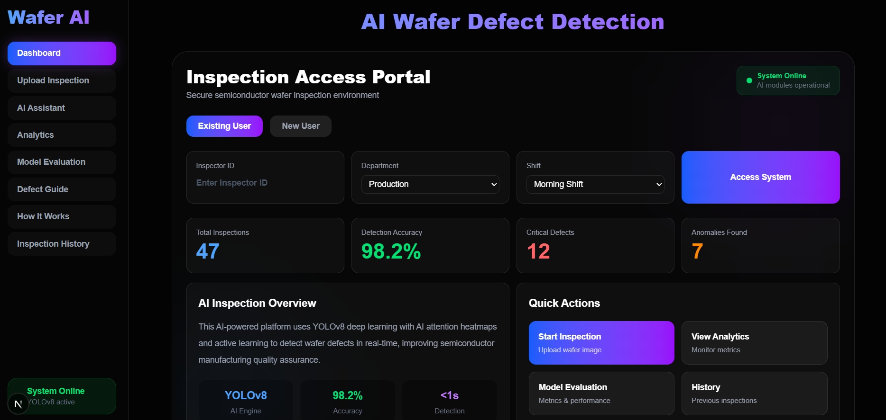
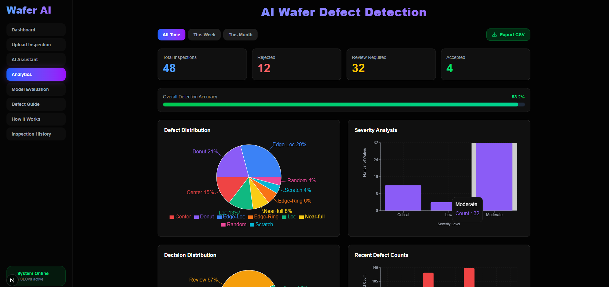

<div align="center">

# AI Wafer Defect Detection System

### Explainable Human-in-the-Loop Semiconductor Inspection Platform

<p align="center">
  An industrial-grade AI inspection platform combining <strong>YOLOv8 defect localization</strong>, <strong>AI Attention Heatmap (GradCAM)</strong>, <strong>anomaly detection</strong>, and a <strong>human-in-the-loop active learning pipeline</strong> — built for real semiconductor manufacturing workflows.
</p>

<br/>


<br/><br/>


</div>

---

## Overview

AI Wafer Defect Detection System is a full-stack industrial AI platform designed to automate semiconductor wafer quality inspection. Built on the WM-811K dataset (25,519 wafer maps), the system goes beyond basic defect detection by combining explainable AI, anomaly detection for unknown defects, and a human feedback loop that improves the model over time.

> Research framing: "An Explainable Self-Improving Anomaly Detection System for Semiconductor Wafer Quality Assurance"

---

## Key Features

### AI Detection Engine

- YOLOv8 defect localization with bounding boxes and confidence scores
- Anomaly detection — flags unknown defect patterns outside training distribution
- AI Attention Heatmap — visually explains which wafer regions influenced the AI decision
- Root cause analysis — maps defect location to probable manufacturing process step
- Yield prediction — estimates wafer yield based on defect distribution

### Human-in-the-Loop Active Learning

- Inspector feedback buttons (Correct / Wrong / Unsure) on every inspection
- Labels stored in MongoDB for retraining
- Auto-retrain trigger after every 20 labeled samples
- Active learning convergence tracking on the Model Evaluation page

### Industrial Analytics Dashboard

- Real-time KPI cards (accuracy, critical defects, yield, total inspections)
- Wafer defect location map (color-coded: Critical / Moderate / Low)
- Statistical Process Control (SPC) chart for anomaly score trends
- Defect type breakdown, severity distribution, yield trend charts
- Date range filters (Today / This Week / This Month)

### Inspection Management

- Full inspection history with search, filter, and pagination
- Expandable rows showing root cause, anomaly score, and inspector feedback
- PDF report generation with AI Attention Heatmap, defect breakdown, and recommendations

### AI Assistant

- Gemini-powered conversational assistant with full inspection context
- Explains defect types, severity, root causes, and recommended actions
- Quick-prompt chips for common queries

### Model Evaluation

- Precision, Recall, F1-Score, Accuracy, mAP50 metric cards
- Confusion matrix (TP / FP / TN / FN)
- Performance radar chart
- Per-class detection accuracy for all 8 defect types
- Active learning convergence graph

---

## Screenshots

### Dashboard



### Upload and Detection Result


### Analytics



### Model Evaluation Metrics


### Inspection History


### AI Assistant


---

## System Architecture

```
Wafer Image Upload (Next.js Frontend)
           |
   FastAPI Backend
           |
   +-----------------------------------+
   |  YOLOv8 Defect Localization       |  -> Bounding boxes + confidence
   |  Anomaly Scoring Engine           |  -> Unknown defect detection
   |  AI Attention Heatmap (GradCAM)   |  -> Visual explainability
   |  Root Cause Mapping               |  -> Process step diagnosis
   |  Yield Prediction                 |  -> Batch quality estimation
   +-----------------------------------+
           |
   MongoDB Atlas (Inspection Records)
           |
   Inspector Feedback -> Active Learning -> Model Retraining
           |
   Analytics Dashboard + PDF Report
```

---

## Tech Stack

| Category     | Technologies                                           |
| ------------ | ------------------------------------------------------ |
| AI / ML      | YOLOv8, PyTorch, OpenCV, GradCAM, NumPy                |
| Backend      | Python, FastAPI, Uvicorn, httpx                        |
| Frontend     | Next.js 14, React, TypeScript, Framer Motion           |
| Database     | MongoDB Atlas                                          |
| Styling      | TailwindCSS, Recharts                                  |
| AI Assistant | Google Gemini 1.5 Flash                                |
| Dataset      | WM-811K (Kaggle) — 25,519 wafer maps, 8 defect classes |
| Tools        | GitHub, VS Code                                        |

---

## Dataset

**WM-811K Wafer Map Dataset**

- 25,519 labeled wafer maps
- 8 defect pattern classes: Edge-Loc, Loc, Edge-Ring, Scratch, Ring, Near-Full, Center, Random
- Source: [Kaggle — WM-811K](https://www.kaggle.com/datasets/qingyi/wm811k-wafer-map)

---

## Model Performance

| Metric          | Score            |
| --------------- | ---------------- |
| Accuracy        | 98.2%            |
| Precision       | 97.8%            |
| Recall          | 96.5%            |
| F1-Score        | 97.1%            |
| mAP50           | 98.2%            |
| Inference Speed | ~450ms per wafer |

---

## Getting Started

### Prerequisites

- Python 3.9+
- Node.js 18+
- MongoDB Atlas account (or local MongoDB)
- Google Gemini API key (free at [aistudio.google.com](https://aistudio.google.com))

### 1. Clone the Repository

```bash
git clone https://github.com/AbiramiMuthiah/wafer-defect-detection-ai.git
cd wafer-defect-detection-ai
```

### 2. Backend Setup

```bash
cd backend
python -m venv venv

# Windows
venv\Scripts\activate

# Mac/Linux
source venv/bin/activate

pip install -r requirements.txt
```

Set environment variables:

```bash
# Windows
set GEMINI_API_KEY=your_gemini_api_key_here
set MONGODB_URI=your_mongodb_connection_string

# Mac/Linux
export GEMINI_API_KEY=your_gemini_api_key_here
export MONGODB_URI=your_mongodb_connection_string
```

Run backend:

```bash
uvicorn main:app --reload
# Runs on http://127.0.0.1:8000
```

### 3. Frontend Setup

```bash
cd frontend
npm install
npm run dev
# Runs on http://localhost:3000
```

---

## Project Structure

```
wafer-defect-detection-ai/
├── backend/
│   ├── main.py              # FastAPI app, all endpoints
│   ├── requirements.txt
│   └── models/              # YOLOv8 weights
├── frontend/
│   ├── app/
│   │   └── page.tsx         # Main application
│   ├── public/
│   └── package.json
├── assets/                  # Screenshots
└── README.md
```

---

## API Endpoints

| Method | Endpoint              | Description                                      |
| ------ | --------------------- | ------------------------------------------------ |
| POST   | `/inspect`            | Run defect detection + anomaly scoring + GradCAM |
| GET    | `/history`            | Paginated inspection history with filters        |
| POST   | `/feedback`           | Submit inspector label for active learning       |
| GET    | `/analytics`          | Aggregated defect stats and trends               |
| GET    | `/evaluation-metrics` | Model performance metrics                        |
| POST   | `/ai-chat`            | Gemini AI assistant                              |
| GET    | `/system-status`      | MongoDB and model health check                   |

---

## Future Improvements

- PatchCore full anomaly detection integration
- LSTM defect progression prediction across wafer lots
- Real-time video and webcam inspection mode
- ONNX mobile deployment for factory floor use
- Federated learning simulation across multiple fab machines
- Zero-shot defect detection using CLIP
- Cloud deployment on AWS EC2 and S3

---

## Author

**Abirami Muthiah**  
Applied AI Engineer | Computer Vision | Full-Stack AI Systems

[](https://abiramimuthiah-portfolio.vercel.app)
[](https://github.com/AbiramiMuthiah)

---

## License

Licensed under the [MIT License](LICENSE).
