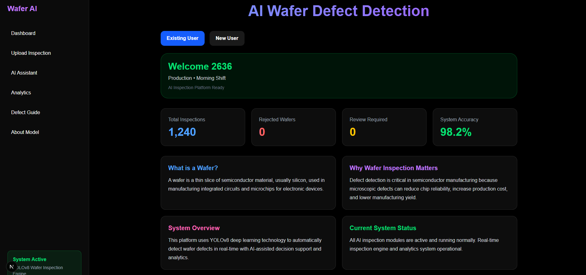
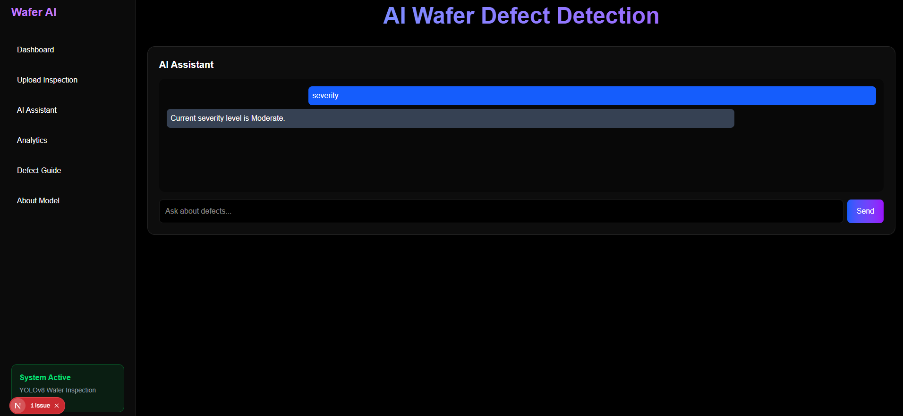
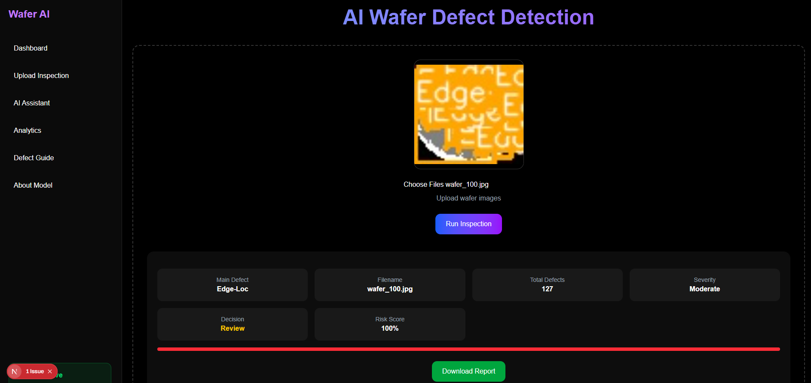
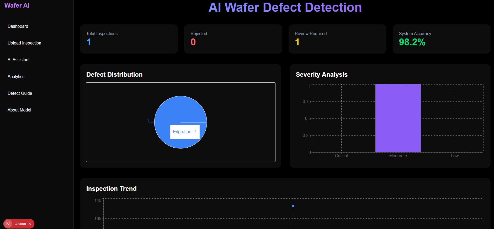
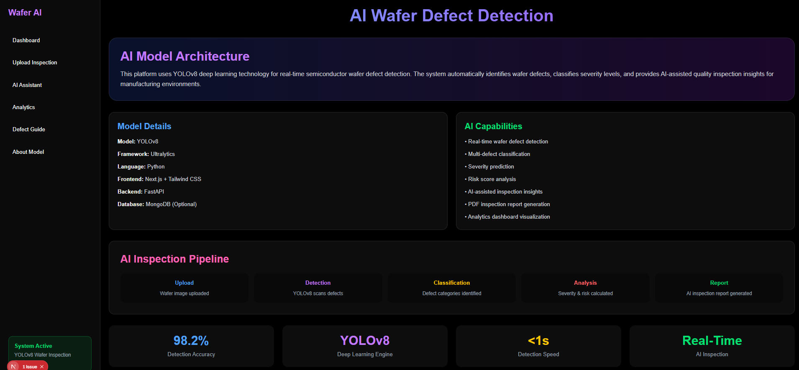

<div align="center">

# Wafer Defect Detection AI

### Intelligent Semiconductor Inspection System Powered by Computer Vision & Deep Learning

<p align="center">
  AI-powered wafer defect detection platform using <strong>YOLOv8</strong>, <strong>FastAPI</strong>, <strong>OpenCV</strong>, and <strong>Next.js</strong> for real-time industrial inspection analytics.
</p>

<br/>


</div>

---

# Overview

Wafer Defect Detection AI is an industrial AI inspection platform designed to automate semiconductor wafer quality analysis using modern computer vision and deep learning technologies.

The system detects wafer defects in real time using a YOLO-based object detection model, performs defect analysis, and provides an interactive AI-powered inspection dashboard for manufacturing workflows.

---

# Core Features

## AI Defect Detection
- YOLOv8-based defect detection
- Real-time wafer image analysis
- Bounding box predictions
- Confidence score visualization

## Industrial Analytics Dashboard
- Modern responsive UI
- Inspection analytics
- Defect summaries
- Severity indicators
- Real-time inspection workflow

## Computer Vision Pipeline
- OpenCV image preprocessing
- Automated detection flow
- Smart defect classification
- AI-driven inspection analysis

## Full-Stack Architecture
- FastAPI backend
- Next.js frontend
- REST API integration
- TailwindCSS UI system

---

# Tech Stack

| Category | Technologies |
|---|---|
| AI / ML | YOLOv8, OpenCV, NumPy |
| Backend | Python, FastAPI, Uvicorn |
| Frontend | Next.js, React, TypeScript |
| Styling | TailwindCSS |
| Tools | GitHub, VS Code |

---

## Project Architecture

```text
Frontend (Next.js)
        ↓
FastAPI Backend
        ↓
YOLOv8 Detection Engine
        ↓
Defect Analysis
        ↓
Inspection Dashboard
```

## Screenshots

### Dashboard



### Ai Assistant



### YOLO Detection



### Analytics



### About Model



System Workflow:
1. User uploads wafer image
2. Backend receives image through FastAPI
3. YOLOv8 performs defect detection
4. Defects are classified and analyzed
5. Results returned to frontend dashboard
6. Analytics and severity reports displayed

### Installation:
Clone Repository
git clone https://github.com/AbiramiMuthiah/wafer-defect-detection-ai.git
cd wafer-defect-detection-ai

### Backend Setup:
cd backend

Create virtual environment:

python -m venv venv

Activate environment:

Windows
venv\Scripts\activate

Install dependencies:

pip install -r requirements.txt

Run backend:

uvicorn main:app --reload

Backend runs on:

http://127.0.0.1:8000

### Frontend Setup:

Open another terminal:

cd frontend

Install dependencies:

npm install

Run frontend:

npm run dev

Frontend runs on:

http://localhost:3000

## Future Improvements:
Edge AI deployment
Real-time factory integration
Explainable AI module
Automated reporting system
Cloud inspection analytics
Multi-defect segmentation

# Project Highlights

- Real-time AI wafer inspection platform
- YOLOv8-based computer vision system
- Full-stack AI architecture
- Industrial analytics dashboard
- FastAPI REST backend
- Modern Next.js frontend
- AI-powered defect severity analysis

# AI Model

Model: YOLOv8
Task: Wafer defect object detection
Framework: Ultralytics
Inference Engine: OpenCV + PyTorch

## Author

Abirami Muthiah  
Applied AI Engineer | Data Science Developer | Computer Vision Enthusiast

GitHub:
https://github.com/AbiramiMuthiah

## License

Licensed under the MIT License.
